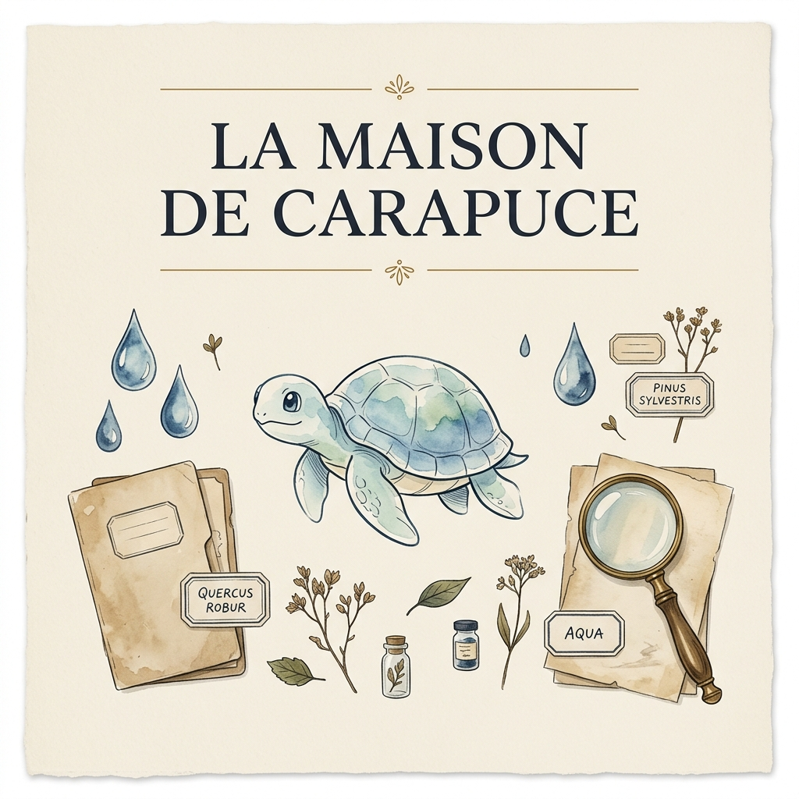

# 🐢 La Maison de Carapuce

<div align="center">
  
  
  <p><em>Une archive vivante et collaborative de toutes les cartes Carapuce (Squirtle) imprimées dans l'histoire, dans toutes les langues et toutes les variantes.</em></p>
  
  <a href="https://github.com/izigower/maison-de-carapuce">
    
  </a>
  <a href="#-progression-générale-de-la-collection">
    
  </a>
  
</div>

---

## 🏛️ La Démarche & La Vision

**La Maison de Carapuce** n'est pas un site de spéculation ni un énième comparateur de prix. C'est un **musée numérique et physique** dédié à l'un des Pokémon les plus emblématiques de l'histoire : **Carapuce (№ 007)**. 

Notre philosophie s'articule autour de trois piliers :
1. **L'exhaustivité absolue** : Nous référençons chaque édition, chaque langue (du français au coréen, en passant par le japonais original), chaque variante (Édition 1, Shadowless, Reverse, Master Ball, etc.) et même les stickers Topps, Merlin ou Panini oubliés.
2. **L'esthétique "Éditorial Musée"** : Le design s'inspire des vieux herbiers et des cartels de musées d'histoire naturelle. Les couleurs (bleu profond, crème chaleureux, laiton) et la typographie soignée créent un écrin haut de gamme pour ces objets de collection.
3. **Le respect artistique & la sobriété** : Pour éviter toute violation de copyright et mettre en avant la structure et l'histoire des cartes, l'archive utilise des **visualisations abstraites et aquatiques (placeholders)** adaptées à chaque variante de carte (ondes, vagues, bulles). Les collectionneurs peuvent y déposer leurs scans pour compléter le catalogue.

---

## 📊 Tableau de Bord de la Collection

<!-- START_STATS -->

### 📊 Progression Générale de la Collection
Voici l'état actuel de la collection physique de la **Maison de Carapuce** :

```text
Progression : [██████░░░░░░░░░░░░░░] 29.2% (7 / 24 cartes)
```

---

### 🌐 Répartition par Langues
<details open>
<summary><b>Cliquez pour voir les statistiques détaillées par langue</b></summary>

| Langue | Cartes Référencées | Cartes Possédées | Progression | Complété |
| :--- | :---: | :---: | :---: | :---: |
| 🇺🇸 **English** (EN) | 15 | 5 | `███████░░░░░░░░░░░░░` | **33%** |
| 🇯🇵 **日本語** (JP) | 3 | 0 | `░░░░░░░░░░░░░░░░░░░░` | **0%** |
| 🇫🇷 **Français** (FR) | 2 | 2 | `████████████████████` | **100%** |
| 🇩🇪 **Deutsch** (DE) | 1 | 0 | `░░░░░░░░░░░░░░░░░░░░` | **0%** |
| 🇮🇹 **Italiano** (IT) | 1 | 0 | `░░░░░░░░░░░░░░░░░░░░` | **0%** |
| 🇪🇸 **Español** (ES) | 1 | 0 | `░░░░░░░░░░░░░░░░░░░░` | **0%** |
| 🇰🇷 **한국어** (KR) | 1 | 0 | `░░░░░░░░░░░░░░░░░░░░` | **0%** |

</details>

---

### 📦 Répartition par Sets & Séries
<details>
<summary><b>Cliquez pour voir les statistiques détaillées par set</b></summary>

| Set / Série | Année | Cartes Référencées | Cartes Possédées | Complété |
| :--- | :---: | :---: | :---: | :---: |
| 📦 **拡張パック** | 1996 | 1 | 0 | **0%** |
| 📦 **Base Set** | 1999 | 1 | 0 | **0%** |
| 📦 **Set de Base** | 1999 | 1 | 1 | **100%** |
| 📦 **Basis-Set** | 1999 | 1 | 0 | **0%** |
| 📦 **Topps TV Animation** | 1999 | 1 | 1 | **100%** |
| 📦 **Merlin Sticker Album** | 1999 | 1 | 0 | **0%** |
| 📦 **Jungle** | 2000 | 1 | 0 | **0%** |
| 📦 **Team Rocket** | 2000 | 2 | 1 | **50%** |
| 📦 **Topps Series 2** | 2000 | 1 | 0 | **0%** |
| 📦 **EX Sandstorm** | 2003 | 1 | 0 | **0%** |
| 📦 **Diamond & Pearl** | 2007 | 1 | 0 | **0%** |
| 📦 **HeartGold SoulSilver** | 2010 | 1 | 0 | **0%** |
| 📦 **Black & White** | 2011 | 1 | 0 | **0%** |
| 📦 **XY Base** | 2014 | 1 | 1 | **100%** |
| 📦 **XY** | 2014 | 2 | 0 | **0%** |
| 📦 **Panini Sticker** | 2014 | 1 | 0 | **0%** |
| 📦 **Evolutions** | 2016 | 2 | 1 | **50%** |
| 📦 **Detective Pikachu** | 2019 | 1 | 1 | **100%** |
| 📦 **Vivid Voltage** | 2020 | 1 | 0 | **0%** |
| 📦 **ポケモンカード151** | 2023 | 1 | 0 | **0%** |
| 📦 **Scarlet & Violet 151** | 2023 | 1 | 1 | **100%** |

</details>

*Dernière mise à jour automatique des statistiques : 16/06/2026 à 19:29:15*

<!-- END_STATS -->

---

## 🗺️ Guide des Variantes & Codes

Pour s'y retrouver dans le musée, chaque carte dispose de tags d'identification en haut à droite :

- **FR / EN / JP / DE...** : Indique la langue d'impression de la carte.
- **Sticker** : Indique un item hors-jeu (Topps, Merlin, Panini).
- **Variante colorée** :
  - <kbd>Édition 1</kbd> (Laiton `#a07a3a`)
  - <kbd>No Rarity</kbd> (Bleu Musée `#2a4a6e`)
  - <kbd>Reverse</kbd> (Violet `#7a4a8a`)
  - <kbd>Holo / Foil</kbd> (Rouge `#a8485a`)
  - <kbd>Master Ball Foil</kbd> (Prune `#5a3878`)
  - <kbd>Poké Ball Foil</kbd> (Orange `#a85838`)
  - <kbd>Movie Promo</kbd> (Doré `#d8a050`)
- **✓ collection** (Vert) : Signale que le conservateur possède physiquement cette carte dans sa collection.

---

## 🤝 Comment Contribuer au Projet ?

Le projet est entièrement communautaire. Vous pouvez participer de trois manières via la page **Contribuer** du site :

*   **Voie I : Recenser une carte** — Renseignez les détails d'une carte Carapuce manquante dans l'index (Set, année, numéro, langue, photos recto/verso).
*   **Voie II : Offrir un item** — Envoyez une carte physique ou un sticker à l'adresse de la Maison (*BP 007, France*) pour l'ajouter à notre coffret physique. Vos dons alimentent le **Mur des Donateurs**.
*   **Voie III : Corriger une notice** — Proposez des modifications si vous détectez une erreur historique ou une faute de frappe sur une fiche.

---

## 🛠️ Installation & Lancement Local

Le projet est propulsé par **Next.js 15**, **TypeScript**, **Supabase** et **Vanilla CSS**.

### 1. Cloner le projet & installer les dépendances
```bash
npm install
```

### 2. Configuration des variables d'environnement
Copiez le fichier exemple et remplissez les clés de votre projet Supabase :
```bash
cp .env.local.example .env.local
```

### 3. Base de données Supabase (Migrations & Seed)
Pour initialiser le schéma de tables et injecter les 24 cartes de démonstration :
```bash
# Appliquer la migration de base
supabase db push (ou exécutez le script dans l'éditeur SQL de Supabase : supabase/migrations/001_initial.sql)

# Injecter les cartes Carapuce de démo
# Exécutez le contenu de supabase/seed.sql dans l'éditeur SQL de Supabase
```

### 4. Lancement du serveur de développement
```bash
npm run dev
```
Ouvrez [http://localhost:3000](http://localhost:3000) pour admirer le musée.

### 5. Mise à jour des statistiques du README
Pour mettre à jour automatiquement les compteurs interactifs et les tableaux par langues/sets ci-dessus à partir des données de la base :
```bash
npm run update-readme
```

---

<div align="center">
  <p>Créé par des fans, pour les fans de 🐢 <strong>Carapuce</strong>.</p>
  <p>© 1996 - 2026 La Maison de Carapuce</p>
</div>
